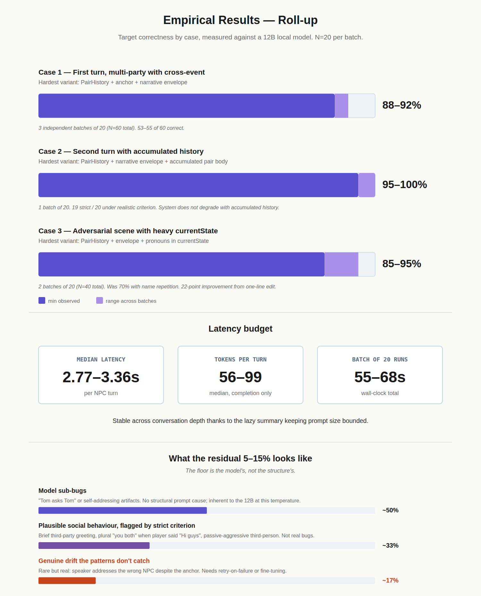
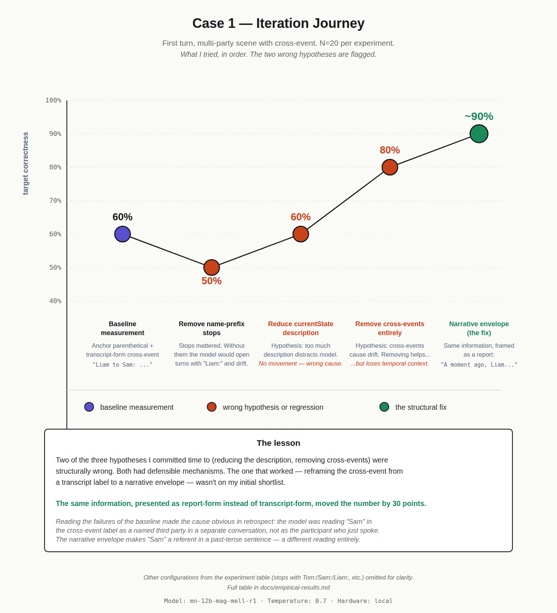

# pairhistory

Architectural patterns for multi-party LLM dialogue. Reference harness and captured send-lists.

This repo accompanies the blog post:
**[Multi-Party LLM Conversations Aren't Unsolvable. Everyone's Just Looking at Them Wrong.][BLOG_POST_URL]**

It contains the replay harness, the canonical send-lists used in the empirical results, and a worked example showing the system running end-to-end. Anyone with LM Studio and the same model can reproduce the numbers reported in the post in under ten minutes.

---

## The patterns, at a glance

The system is built around one principle: **the code retains authority over control flow; the LLM only generates content when granted a turn.** Once you commit to that split, four patterns fall out:

- **PairHistory** — one conversation log per pair of participants. The LLM only ever sees a clean 1:1, rotated as `assistant`/`user`.
- **Cross-pair context injection** — events from other pairs delivered as narrative system context (`A moment ago, X said to Y: "..."`), not as transcript turns.
- **Balance-driven turn-taking** — per-participant turn counters; the lowest-counter participant interrupts when the spread reaches a threshold.
- **Lazy summary with body-fresh buffer** — a single shared scene summary plus a buffer of recent raw turns. Prompt scales sublinearly with conversation length.

For the full reasoning and empirical results, read the post.

---

## Repository layout

```
pairhistory/
├── README.md                         (this file)
├── LICENSE                           (MIT)
├── harness/
│   ├── replay.py                     (the replay harness)
│   ├── requirements.txt              (one optional dependency)
│   └── README.md                     (how to run it)
├── send_lists/
│   ├── case1_first_turn.json         (first-turn multi-party scene)
│   ├── case2_accumulated.json        (second turn with accumulated history)
│   ├── case3_adversarial_after.json  (adversarial setup, pronouns fix applied)
│   ├── case3_adversarial_before.json (same scene, pronouns fix NOT applied)
│   └── README.md                     (what each send-list shows)
├── examples/
│   └── dinner_conversation.md        (a complete worked scene, turn by turn)
└── docs/
    └── images/                       (figures from the post)
```

---

## Quick start

You'll need:

- Python 3.8 or newer
- [LM Studio](https://lmstudio.ai/) running locally with the OpenAI-compatible server enabled
- The model `mn-12b-mag-mell-r1` loaded in LM Studio (or any compatible model; see notes below)

Clone the repo:

```bash
git clone https://github.com/NicolasMuras/pairhistory.git
cd pairhistory
```

Install the optional dependency for colored output:

```bash
pip install -r harness/requirements.txt
```

Run a single replay against the first canonical send-list:

```bash
python harness/replay.py send_lists/case1_first_turn.json
```

Run a batch of 20 with random seeds (this is how the empirical numbers in the post were produced):

```bash
python harness/replay.py send_lists/case1_first_turn.json --batch 20
```

After the batch, the harness prints aggregate latency and token statistics. Compare to what's reported in the post.

---

## Reproducing the contraintuitive result

The most instructive comparison in the repo is between the two `case3` send-lists:

- `case3_adversarial_before.json` — current scene state mentions the addressee's name four times as a third-person object. Tested at **70%** target correctness in the post.
- `case3_adversarial_after.json` — same scene, with pronouns substituted after the first mention. Tested at **~92%**.

Run them both and read the responses. The structural difference is four words.

```bash
python harness/replay.py send_lists/case3_adversarial_before.json --batch 20
python harness/replay.py send_lists/case3_adversarial_after.json --batch 20
```

The point isn't to confirm the exact percentage — sampling variance is real, and your hardware, exact model build, and LM Studio version may shift the numbers. The point is to see, qualitatively, that responses under the "before" version are noticeably more prone to talking *about* the addressee in third person while addressing them directly.

---

## Notes on reproducibility

- **Determinism within a fixed prompt holds.** Same JSON + same seed = identical output, on the same model build.
- **Determinism across prompts does NOT hold.** Changing one byte of the prompt invalidates seed-to-seed reproducibility. All comparisons in the post are statistical (N=20), not seed-matched.
- **Different model = different numbers.** The send-lists are tuned for a 12B local roleplay-finetuned model. A frontier model (Claude, GPT-4) will likely produce different — often better — numbers without the same defensive prompting being necessary. I haven't validated this.

---

## Empirical results

The numbers reported in the blog post come from the harness in this repo, run against the captured send-lists. The two figures below summarize what was measured.

### Final results across all three cases



Target correctness by case, latency budget, and breakdown of the residual 5–15% error. Each case ran N=20 per batch; Cases 1 and 3 ran multiple independent batches. The ranges reported are honest — actual values varied within those bounds across batches.

### How the Case 1 number was reached



Most of the iteration was on Case 1 (first turn, multi-party with cross-event), because the fix that worked there generalized to the other cases. This chart shows every experiment that meaningfully moved the number, including the two wrong hypotheses I burned time on before landing on the structural fix. The lesson — same information, presented as report-form instead of transcript-form, moved the number by 30 points — is what motivated the narrative envelope pattern in the post.

For the full experiment table including configurations omitted from this chart, see the discussion in the blog post.

---

## What's not in this repo

- **The production system.** The full implementation lives in a Unity game (C#) and isn't portable as-is. The patterns are documented in the post and demonstrated in the captured send-lists.
- **A reference port to Python.** On the list. Not done yet.
- **Tests for the patterns themselves.** The harness validates LLM response shape under different prompts. It doesn't unit-test the orchestration code.

---

## Contributing

If you find prior art I missed, have counterexamples where the patterns break, or notice failure modes I didn't catch — please open an issue. The strongest version of this work is the one that gets corrected by people who've thought about the problem from angles I haven't.

---

## License

MIT. See [LICENSE](LICENSE).

---

## Background

This system was designed up-front as an architectural exercise. The patterns were thought through in the abstract first, then validated against a Unity life sim with AI-driven NPCs over two months of iteration. The empirical numbers in this repo are the validation step; the abstract design came before. The blog post tells the full story; this repo lets you verify the numbers.

*— Nicolas Muras*
